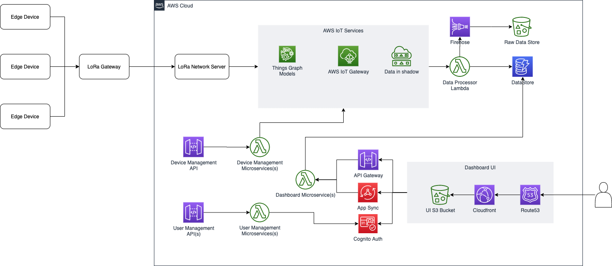

# Asset Tracking Kit
This repository contains code for the Asset Tracking Kit from AWS, Semtech &amp; TensorIoT

# Project Architecture

# Installation Instructions

## Prerequisites

1. Clone this repo
2. AWS Account & Access keys configured on your local desktop
3. Access to deploy cloudformation
4. Cognito User Pool with a web client id
5. AWS cli
6. AWS sam cli
7. nodejs
8. yarn

# Backend Build & Deployment

1. change directory into the Backend folder
2. sam build
3. sam deploy --guided
4. Note down the api gateway url that is outputed as part of the above step

# Frontend Build & Startup

1. change directory into the Frontend folder
2. Open the file Frontend/src/services/axiosCall.js
- Update line number 4 with the api gateway url from above backend install step

3. Open the file Frontend/src/awsConfig.js
- Update lines 7, 8 and 9 with the relavant cognito information
- Update line number 15 with the api gateway url from above backend install step

4. yarn install
5. yarn start

